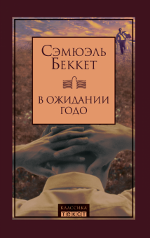
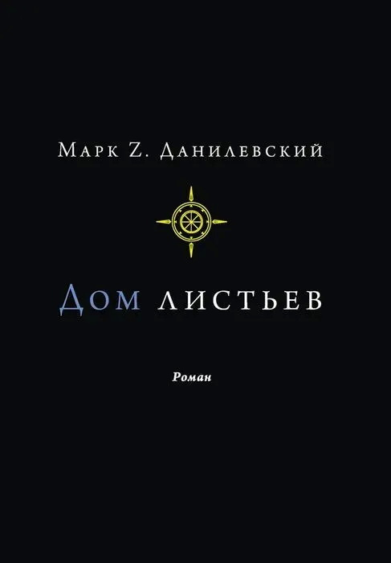
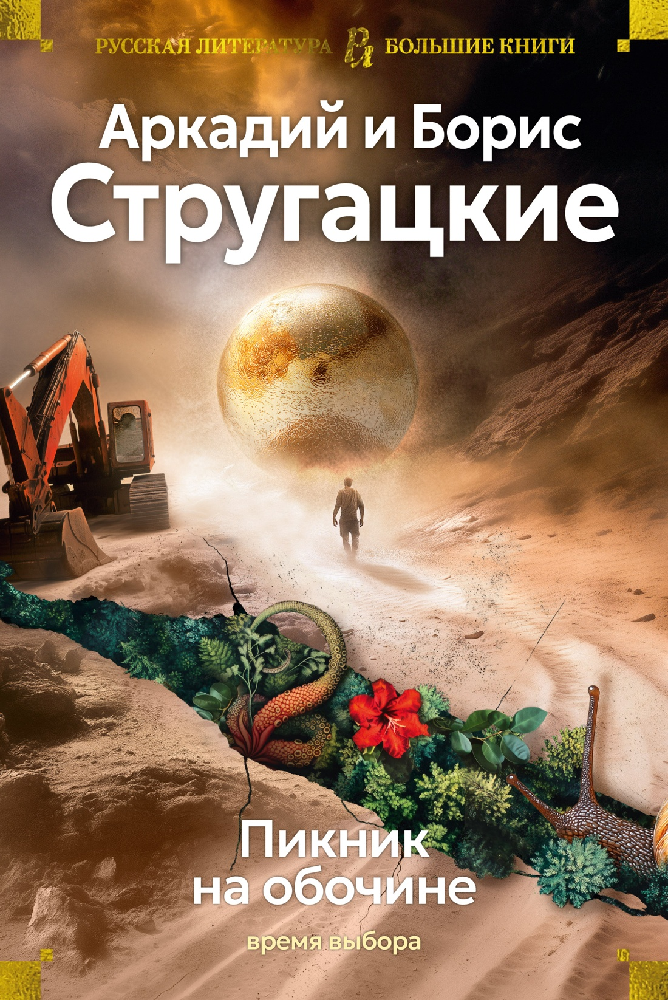

<html lang="ru">
<head>
    <meta charset="UTF-8">
    <meta name="viewport" content="width=device-width, initial-scale=1.0">
    <title>Мой Магазин</title>
    
</head>
<body>

<header><h1>Мой Интернет-Магазин</h1></header>

<nav>
    <a href="#">Главная</a>
    <a href="#">Каталог</a>
    <a href="#">О нас</a>
</nav>

<main class="container">
    <!-- Карточка 1 -->
    

        
        

            <h3>Товар 1</h3>
            
«В ожидании Годо» представляет собой трагедию, в которой «ничего не происходит, никто не приходит, никто не уходит». Произведение сосредоточено на изображении состояния человеческой психики, процесса психической деятельности и её нарушений. Персонажи пьесы не обладают ярко выраженными характерами, а сюжет лишён последовательного развития. «В ожидании Годо» является подлинным новаторством в истории театра и первой успешно поставленной пьесой театра абсурда 

            
1 500 ₽

            <a href="#" class="btn">В корзину</a>
        

    

    <!-- Карточка 2 -->
    

        
        

            <h3>Товар 2</h3>
            
"Дом листьев" — это роман, который сочетает в себе элементы ужасов, любви, сатиры и исследовательских работ. Он рассказывает о стремительно расширяющемся доме, который становится объектом интереса и исследований, включая фундаментальное исследование о фильме, которого не существует, сделанное слепым стариком. Роман также исследует записки из лабиринтов подсознания и сентиментальное блуждание по инфернальным кругам жизни. "Дом листьев" стал известным благодаря своей необычной структуре и формам изложения, которые делают его ярким примером эргодической литературы. 

            
2 500 ₽

            <a href="#" class="btn">В корзину</a>
        

    

    

        
        

            <h3>Товар 2</h3>
            
Пикник на обочине
фантастическая повесть братьев Стругацких, впервые изданная в 1972 году. Действие повести происходит на Земле предположительно в 1970-е годы в городке Хармонт, в выдуманной англоязычной стране. Одна из основных тем — нравственный выбор тех, в чьи руки попадают артефакты Зоны, то, как ими воспользуется человечество, которое, строго говоря, плохо понимает, в чём предназначение этих опасных вещей, неизвестно зачем оставленных пришельцами.

            
2 500 ₽

            <a href="#" class="btn">В корзину</a>
        

    

</main>

<footer>&copy; 2026 Мой Магазин</footer>

</body>
</html>
